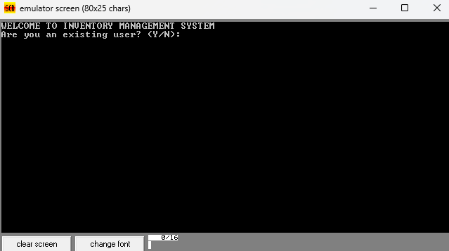
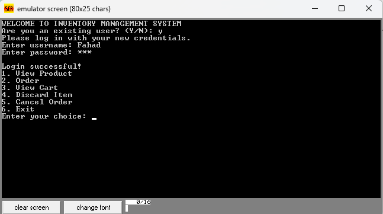
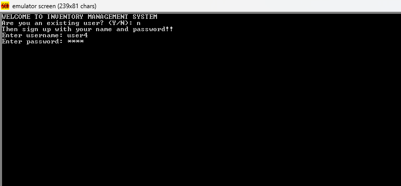
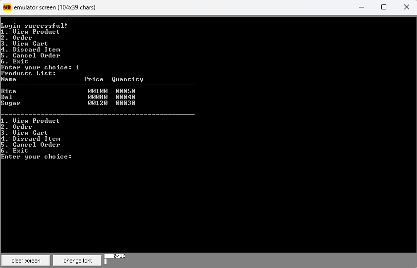
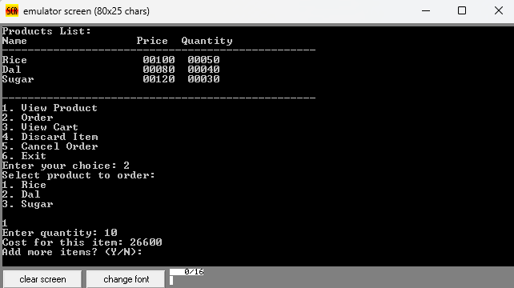
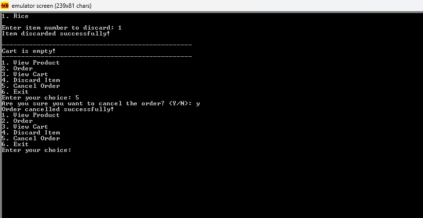
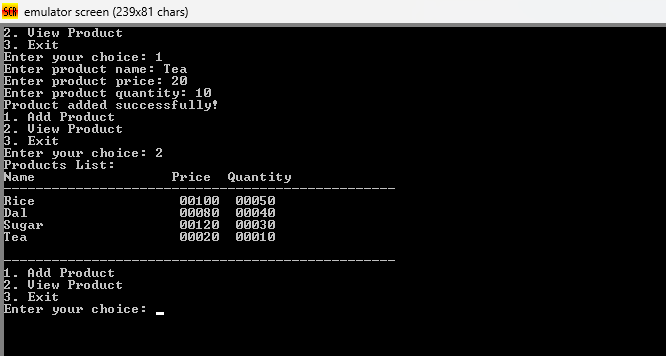

# CSE 341: Microprocessors Lab Repository

Welcome to the **CSE 341 Microprocessors Lab** repository. This repository contains all the materials and resources for the lab, focusing on Intel 8086 assembly language programming. It also includes a project that showcases the practical application of assembly language concepts.

---

## Repository Contents

### **1. Lab Exercises**

#### **1.1 Microprocessor Intel 8086 Assembly Language Introduction**
- Overview of the 8086 architecture.
- Basic assembly language instructions.
- Assembling, linking, and running assembly programs.

#### **1.2 Basic I/O, Advanced Arithmetic Operations, and Flags**
- Input and output operations.
- Performing advanced arithmetic operations.
- Understanding and utilizing flags (carry flag, zero flag, etc.).

#### **1.3 Flow Control Instructions and Branching Structures**
- Conditional and unconditional jump instructions.
- Decision-making constructs in assembly language.

#### **1.4 Flow Control Instructions and Looping Structures**
- Loop instructions and their implementation.
- Iterative operations and their applications.

#### **1.5 Arrays**
- Defining and manipulating arrays in assembly language.
- Accessing and modifying array elements.

#### **1.6 Stack**
- Working with the stack and stack-related instructions.
- Function call mechanisms using the stack.

---

### **2. Project: Grocery/Inventory Management System**

This project demonstrates the practical application of assembly language concepts to develop a simple grocery/inventory management system. 

#### **Project Features**

1. **User Login via Password Check**

        
        

   - Only authorized users can log in to purchase grocery items.
   - Password verification ensures secure access.

2. **Adding User**

        

   - New users can sign up by creating an account.

3. **Display Inventory Items**

        

   - A list of all available inventory items is displayed.
   - Users can view item details (e.g., name, price, quantity).

5. **Order Items**

        

   - Users can select and add items to their cart.
   - The cart is dynamically updated with selected items.

6. **Generate and Calculate Bill**
   - Calculates the total price for all items in the cart.
   - Generates a final list of items and their prices.

7. **Discard Items and Cancel Order**

        

   - Users can remove specific items from their cart.
   - Option to cancel the entire order.

8. **Admin Panel**

        
        

   - Admins can add new products to the inventory.
   - Allows management of inventory items, including updating quantities and prices.

---

## How to Use

1. **Clone the Repository**
   ```bash
   git clone https://github.com/yourusername/case341-microprocessor-lab.git
   ```

2. **Navigate to Lab Exercises**
   - Each lab exercise is contained within its own directory.
   - Explore the code and comments to understand the concepts.

3. **Run the Project**
   - Navigate to the `Grocery_Inventory_Management_System` directory.
   - Follow the instructions provided in the `README` within the project folder to execute the program.

---

## Technologies Used

- **Intel 8086 Assembly Language**
- **emu8086 8086 Microprocessor emulator**


## License

This repository is licensed under the MIT License. See the [LICENSE](LICENSE) file for details.

---

## Acknowledgments

- **BRAC University, Department of Computer Science and Engineering**
- Special thanks to the course instructor and teaching assistants for their guidance and support.
